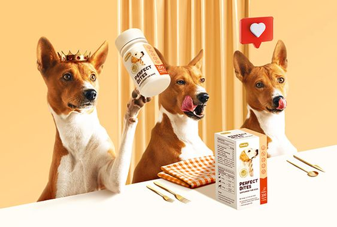

# EX-01 Developing a Simple Webserver
## Date: 26/03/24

## AIM:
To develop a simple webserver to serve html pages.

## DESIGN STEPS:
### Step 1: 
HTML content creation.

### Step 2:
Design of webserver workflow.

### Step 3:
Implementation using Python code.

### Step 4:
Serving the HTML pages.

### Step 5:
Testing the webserver.

## PROGRAM:
```
from http.server import HTTPServer, BaseHTTPRequestHandler

content = """
<!DOCTYPE html>
<html lang="en">
    <head>
        <title>Petshop</title>
        <link rel="stylesheet" href="style.css">
        <link rel="stylesheet" href="https://cdn.jsdelivr.net/npm/bootstrap-icons@1.11.3/font/bootstrap-icons.min.css">
        <link href="https://cdn.jsdelivr.net/npm/bootstrap@5.3.3/dist/css/bootstrap.min.css" rel="stylesheet" integrity="sha384-QWTKZyjpPEjISv5WaRU9OFeRpok6YctnYmDr5pNlyT2bRjXh0JMhjY6hW+ALEwIH" crossorigin="anonymous">
        <style>.header{

            background-color:bisque;
            display: flex;
            padding: 20px;
            font-family:'Segoe UI', Tahoma, Geneva, Verdana, sans-serif  ;
            height: 90px;
        }
        
        .logo
        {
            position: absolute;
            left: 40%;
            display: flex;
            align-items: center;
            justify-content: center;
        }
        li{    
            display: inline-block  ;
            margin-right: 8px;
        }
        
        nav{
            position: absolute;
            left: 80%;
            right: 10px;
        }
        
        
        #imglogo{
            border-radius: 45px;
            height: 45px;
            width: 45px;
        }
        
        .menu {
            list-style-type:none;
            padding: 0;
            margin: 0;
        } 
        
        .nav-item {
            display: inline-block;
            margin-right: 20px;
            /* align-items:  */
        }
        
        .dropdown-menu {
            display: none;
            position: absolute;
            border: 1px ;
            z-index: 1;
        }
        
        .dropdown-menu li {
            padding: 10px;
        }
        
        .dropdown-item {
            text-decoration: none;
            display: block;
        }
        
        .social {
            display: flex;
            /* justify-content: center;  */
        }
        
        .social i {
            font-size: 20px; 
            margin-right: 20px; 
            align-items: center; 
        }
        
        
        
        .border{
            position: absolute;
            top: -50px; 
            left: 0; 
            width: 100%;
        }
        
        .content {
            /* Style for the div element with class "content" */
            display: flex;
            margin-top: 30px; 
            width: 100%;/* Add space at the top */
            height:150px;
            align-items: center;
            justify-content: space-evenly;
            font-size:20px ;
            font-family:'Lucida Sans', 'Lucida Sans Regular', 'Lucida Grande', 'Lucida Sans Unicode', Geneva, Verdana, sans-serif;    
            background-color: #f0f0f0; /* Background color */
            padding: 10px; /* Padding around the content */
            border: 1px solid #ccc; /* Border */
        }
        .petimg {
            height: 100px;
            width: 100px;
            border-radius: 50px;
        }
        </style>

    </head>
    <style>
      i:hover {
            color:gray;
        }
    </style>
    <body>
        <div class="header">
            <div class="logo">
                
                <h1>PURRFECT PAW</h1>
            </div>
            <!-- <a href="https://www.flaticon.com/free-icons/paw-print" title="paw print icons">Paw print icons created by Freepik - Flaticon</a> -->
                <nav>  
                <ul>
                    <li><i class="bi bi-house"></i><a>HOME</a></li>
                    <li><i class="bi bi-telephone-fill"></i><a>CONTACT</a></li>
                    <li><i class="bi bi-person-circle"></i><a>LOGIN</a></li>
                </ul>
                </nav>
                <div class="col-1">
                <div class="social">
                  <i class="bi bi-instagram"></i>
                  <i class="bi bi-whatsapp"></i>
                  <i class="bi bi-facebook"></i>
                  <i class="bi bi-twitter"></i>

                  <i class="bi bi-envelope"></i></div><br>
                  <a><purrfectpaw2024@gmail.com</a>
                </div>
                </div>
    
        </div>
        <div class="shop">
            <button class="navbar-toggler" type="button" data-bs-toggle="collapse" data-bs-target="#navbarNavDropdown" aria-controls="navbarNavDropdown" aria-expanded="false" aria-label="Toggle navigation">
                <span class="navbar-toggler-icon"></span>
              </button>
              <ul>
                <li class="nav-item dropdown">
                    <a class="nav-link dropdown-toggle" href="#" role="button" data-bs-toggle="dropdown" aria-expanded="false">
                      Shop by pet
                    </a>
                    <ul class="dropdown-menu">
                        <li><a class="dropdown-item" href="#">Dog</a></li>
                        <li><a class="dropdown-item" href="#">Cat</a></li>
                        <li><a class="dropdown-item" href="#">Fish</a></li>
                        <li><a class="dropdown-item" href="#">Bird</a></li>
                      </ul>
                      <li class="nav-item dropdown">
                        <a class="nav-link dropdown-toggle" href="#" role="button" data-bs-toggle="dropdown" aria-expanded="false">Shop by Breed</a>
                        <ul class="dropdown-menu">
                            <li><a class="dropdown-item" href="#">Breed 1</a></li>
                            <li><a class="dropdown-item" href="#">Breed 2</a></li>
                            <li><a class="dropdown-item" href="#">Breed 3</a></li>
                            <li><a class="dropdown-item" href="#">Breed 4</a></li>
                        </ul>
                    </li>
                    <li class="nav-item dropdown">
                        <a class="nav-link dropdown-toggle" href="#" role="button" data-bs-toggle="dropdown" aria-expanded="false">Shop by Brand</a>
                        <ul class="dropdown-menu">
                            <li><a class="dropdown-item" href="#">Brand 1</a></li>
                            <li><a class="dropdown-item" href="#">Brand 2</a></li>
                            <li><a class="dropdown-item" href="#">Brand 3</a></li>
                            <li><a class="dropdown-item" href="#">Brand 4</a></li>
                        </ul>
                      </li>
                      
                      <form class="d-flex" role="search" style="padding-left: 80%; justify-content:flex-start;">
                        <input class="form-control me-2" type="search" placeholder="Search" aria-label="Search">
                        <button class="btn btn-outline-success" type="submit">Search</button>
                    </form>

                </ul>
                <div class="col-3 bgc">
                  <div class="border">
                      <i class="bi bi-search"></i>
                      <input type="text" class="bgc border-0">
                  </div>
              </div>
              
        </div>
        <!-- <div style="display:flex;"> -->
            
            <div style="height:100%; width: 100%;">
                <div id="carouselExampleIndicators" class="carousel slide" data-bs-ride="carousel" data-bs-interval="2000">

            <div class="carousel-indicators">
              <button type="button" data-bs-target="#carouselExampleIndicators" data-bs-slide-to="0" class="active" aria-current="true" aria-label="Slide 1"></button>
              <button type="button" data-bs-target="#carouselExampleIndicators" data-bs-slide-to="1" aria-label="Slide 2"></button>
              <button type="button" data-bs-target="#carouselExampleIndicators" data-bs-slide-to="2" aria-label="Slide 3"></button>
              <button type="button" data-bs-target="#carouselExampleIndicators" data-bs-slide-to="3" aria-label="Slide 4"></button>
              <button type="button" data-bs-target="#carouselExampleIndicators" data-bs-slide-to="4" aria-label="Slide 5"></button>
            </div>
            <div class="carousel-inner">
              <div class="carousel-item active">
                
              </div>
              <div class="carousel-item">
                
              </div>
              <div class="carousel-item">
                
              </div>
              <div class="carousel-item">
                
              </div>
              <div class="carousel-item">
                
              </div>
            </div>
            <button class="carousel-control-prev" type="button" data-bs-target="#carouselExampleIndicators" data-bs-slide="prev">
              <span class="carousel-control-prev-icon" aria-hidden="true"></span>
              <span class="visually-hidden">Previous</span>
            </button>
            <button class="carousel-control-next" type="button" data-bs-target="#carouselExampleIndicators" data-bs-slide="next">
              <span class="carousel-control-next-icon" aria-hidden="true"></span>
              <span class="visually-hidden">Next</span>
            </button>
        </div>

        <div class="content">
          <a>Lets shop by pet</a>
            <!-- <div class="image-content"> -->
              
              
              
              
            <!-- </div> -->
        </div><br>
        
        <div class="card-group">
          <div class="card">
            
            <div class="card-body">
              <h5 class="card-title">How to Keep Your Dogs Calm During Visit?</h5>
              <p class="card-text">Not all dogs like visiting a vet. The strange smells, poking, jabs, and unfamiliarity of the veterinary clinic can make the dogs anxious.</p>
              <p class="card-text"><small class="text-body-secondary">Last updated 3 mins ago</small></p>
            </div>
          </div>
          <div class="card">
            
            <div class="card-body">
              <h5 class="card-title">How to Teach Your Dogs to Walk Nicely On a Leash?</h5>
              <p class="card-text">One of the most enriching experiences in life is walking with a dog and exploring the world together. It benefits the health of both dogs and owners and is a great opportunity. </p>
              <p class="card-text"><small class="text-body-secondary">Last updated 3 mins ago</small></p>
            </div>
          </div>
          <div class="card">
            
            <div class="card-body">
              <h5 class="card-title">10 Dog Breeds That Are Great For Children</h5>
              <p class="card-text">Choosing the right dog for your family goes a long way in keeping good ambience in the house. If you have children, then the selection becomes even more crucial.</p>
              <p class="card-text"><small class="text-body-secondary">Last updated 3 mins ago</small></p>
              <br>
            </div>
          </div>
          </div>
          <center>
          <div style="background-color:bisque;"><h4>23, New street, Nungambakkam</h4>
          <h5>+04414578652</h5>
          <h6>purrfectpaw2024@gmail.com</h6></div>
        </center>
        <br>
        <script src="https://cdn.jsdelivr.net/npm/bootstrap@5.3.3/dist/js/bootstrap.bundle.min.js" integrity="sha384-YvpcrYf0tY3lHB60NNkmXc5s9fDVZLESaAA55NDzOxhy9GkcIdslK1eN7N6jIeHz" crossorigin="anonymous"></script>
    </body>
</html>
"""

class MyHandler(BaseHTTPRequestHandler):
    def do_GET(self):
        print("request received")
        self.send_response(200)
        self.send_header('Content-type', 'text/html; charset=utf-8')
        self.end_headers()
        self.wfile.write(content.encode())

server_address = ('', 8000)
httpd = HTTPServer(server_address, MyHandler)

print("my webserver is running...")
httpd.serve_forever()

```


## OUTPUT:


## RESULT:
The program for implementing simple webserver is executed successfully.
